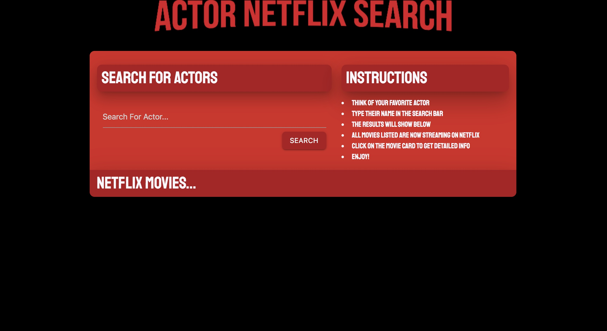

### Table of Contents 
* [Description](#description) 
* [Technologies-Libraries](#technologies-libraries) 
* [APIs](#apis)
* [Screenshot](#screenshot)
* [Breakdown](#breakdown)
* [Credits](#credits) 

## Description 
Actor Netflix User Search is a website designed to let users, who have favorite actors, to search their favorite actor and see what movies are available to them on Netflix. 

## Technologies-Libraries
Node - Express - JavaScript - JQuery - Bootstrap - CSS - HTML

## APIs 
WhatIsMyMovie? - UNOGS - Netflix

## Screenshot


Live link: Unfortunately the project runs on a limited number of queries before it is charged. 
To view this project please install by:
In your terminal type:
```git clone https://github.com/verlitas/ANS.git```
* Open in Visual Studio replace api keys, build and run.
* For further instructions, visit https://help.github.com.

## Breakdown 
Front End
* Learn new CSS Framework
* HTML & CSS Layout
* Search Button (Functionality by Back-end)
* Display Results (Generate through JS, results provided by Back-end)
* Display Modal Information when movie is clicked on.

## Back End
* Query "WhatIsMyMovie?" for a list of movies by searching an actor
* Return a list of movies from the query
* Query "UNOGS" for movies on Netflix from our list.
* Generate Netflix movies' list
* Send list to front end

## Credits
[Melody Kirshberg](https://github.com/verlitas)  
[Brian Graf](https://github.com/astrobeef)  
[Martin Stovall](https://github.com/RebelCommand78)  
[Richard Klevan](https://github.com/raklevan)  
[UABootCamp](https://bootcamp.ce.arizona.edu/coding/)  
