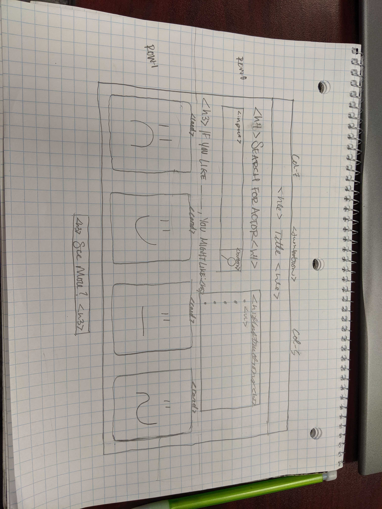

# Actor Netflix User Search - Project 1

### Table of Contents 
* [Description](#description) 
* [Userstory](#userstory) 
* [Wireframe](#wireframe)
* [APIs](#apis)
* [Breakdown](#breakdown)
* [Credits](#credits) 

### Description 

### Userstory
AS A netflix user with a favorite actor
I WANT to know which movies are currently streaming on netflix featuring my favorite actor
SO THAT i will know what movie titles to search on netflix. 
____________________________________________________________

GIVEN a user specified actor name
WHEN the name is entered into the search bar and submitted
THEN the user is provided with a list of movies featuring the actor that are currently streaming on netflix

### Wireframe

### APIs 
* WhatIsMyMovie?
* UNOGS
* Netflix

### Breakdown 
Front End
* Learn new CSS Framework
* HTML & CSS Layout
* Search Button (Functionality by Back-end)
* Display Results (Generate through JS, results provided by Back-end)
* Display Modal Information when movie is clicked on.

Back End
* Query "WhatIsMyMovie?" for a list of movies by searching an actor
* Return a list of movies from the query
* Query "UNOGS" for movies on Netflix from our list.
* Generate Netflix movies' list
* Send list to front end

### Credits
Brian, Martin, Melody, Richard